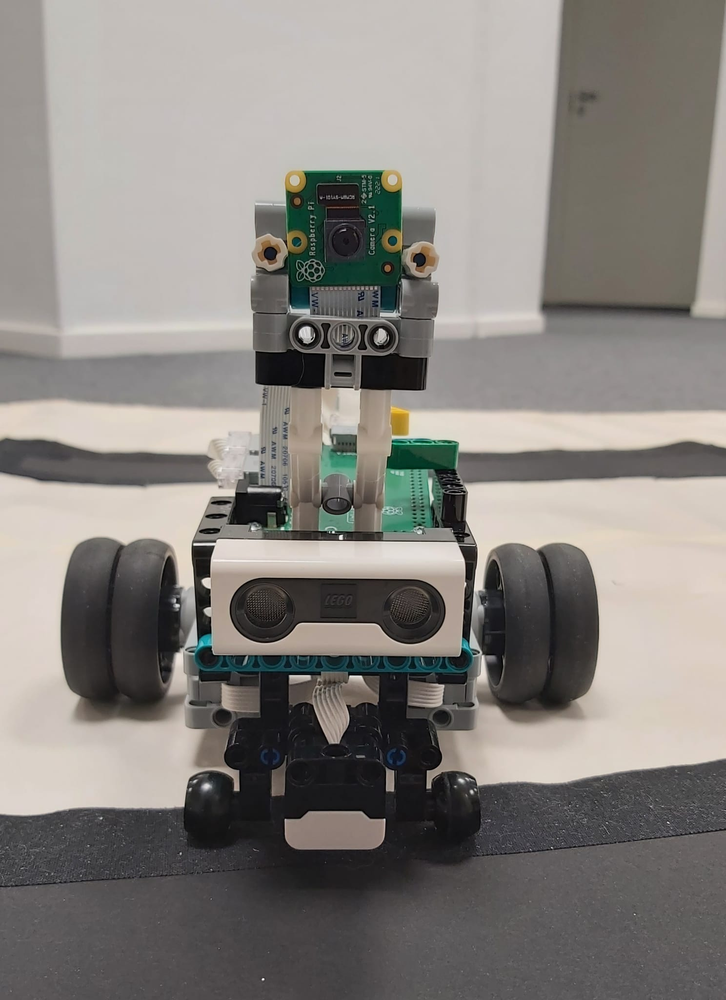

# Tensor-Flow-Navigate-Bot
A project that combines LEGO Mindstorms 51515, Raspberry Pi 4, and TensorFlow for training an AI model to navigate and make decisions based on detected signs.

## Table of Contents
1. [Introduction](#introduction)
2. [Repository Structure](#repository-structure)
3. [Getting Started](#getting-started)
    - [Prerequisites](#prerequisites)
    - [Installation](#installation)
4. [Usage](#usage)
5. [Training the Model](#training-the-model)
6. [Contributors](#contributors)
7. [License](#license)
8. [Acknowledgements](#acknowledgements)

## Introduction

Our goal is to create a smart robot capable of navigating its environment, making decisions based on detected signs, and responding to visual cues. The project leverages the following hardware and software components:



### Hardware Components
**Lego Mindstorms Set (Model 51515):** Serving as the foundation of our robot's construction, the Lego Mindstorms set provides an extensive collection of building blocks and components essential to the success of our venture.

**Raspberry Pi 4:** The brain of our robot is powered by the Raspberry Pi 4, a high-performance microcomputer serving as the central processing unit for executing our Python code. The Raspberry Pi seamlessly integrates with the Lego BuildHAT, a dedicated hardware attachment facilitating the incorporation of sensors and enhancing the overall capabilities of our robot.

**Lego BuildHAT:** This dedicated hardware attachment enhances the versatility of our robot by facilitating seamless integration of sensors and other components, contributing to its robust functionality.

**Raspberry Pi Camera Module:** For advanced vision capabilities, we employ the Raspberry Pi Camera Module. This enables our robot to capture visual data, learn from its surroundings, and later detect signs, contributing to its ability to navigate and make informed decisions.

### Software Components
**Programming Language:** Python: Our project is primarily coded in Python, chosen for its versatility and ease of use in the realm of robotics development. Python's rich ecosystem of libraries and its suitability for rapid prototyping make it an ideal choice for implementing the intelligent algorithms guiding our robot.

How it Works
Tensor Flow Navigate Bot utilizes the power of TensorFlow for training its own data. The robot is equipped with the ability to turn left, turn right, and stop. Its intelligent decision-making process involves detecting objects(signs) in its path using the Raspberry Pi Camera Module, and based on the detected signs, it makes informed decisions to turn or continue to wait.

We invite you to explore the contents of this repository to delve deeper into the code, training processes, and the intricate details of our robot's construction.

Feel free to contribute, learn, and be a part of our exciting journey in creating a smart, autonomous robot. Together, let's navigate the future with TensorFlowNavigateBot!


## Repository Structure

Here is an overview of the current structure of the repository: Note that this is an just a example:: about to add correct files

```
.
├── src/
│ ├── main.py # Main code to control the robot
│ ├── rtod.py # Code for path follow and sign detection
│ └── ...
├── tflow/
│ ├── template.tflite # Trained data for the robot
│ ├── detect.py # Code to detect signs and identify based on trained data (train_data.tflite)
│ └── ...
├── training/
│ ├── train_data.py # Code used to train data according to project requirements
│ ├── existing_repo_code/ # Code obtained from existing TensorFlow repositories
│ └── ...
├── data/
│ ├── training_data/ # Store your training dataset here
│ └── ...
├── models/
│ ├── trained_model/ # Store your trained TensorFlow model here
│ └── ...
├── docs/ # Documentation for your project
├── README.md # Project README file
├── requirements.txt # List of Python dependencies
└── ...
```

## Getting started
  ### Prerequisites
  ### Installation


## Usage

## Training the model

## Contributors

- [Antti Buller](https://github.com/anatt1b)  
- [Inosha Sugathapala](https://github.com/Inoshas)

## License
MIT License

## Acknowledgements
This project has used components belogs to Opiframe and its premises to test everything.

- [Opiframe](https://opiframe.com)  
- [Janne Kemppi](https://jannekemppi.wordpress.com) 
- [Jussi Riihijärvi](https://www.linkedin.com/in/jussiriihij%C3%A4rvi)

## Referece
- [tflite-custom-object-bookworm](https://github.com/freedomwebtech/tflite-custom-object-bookworm)


